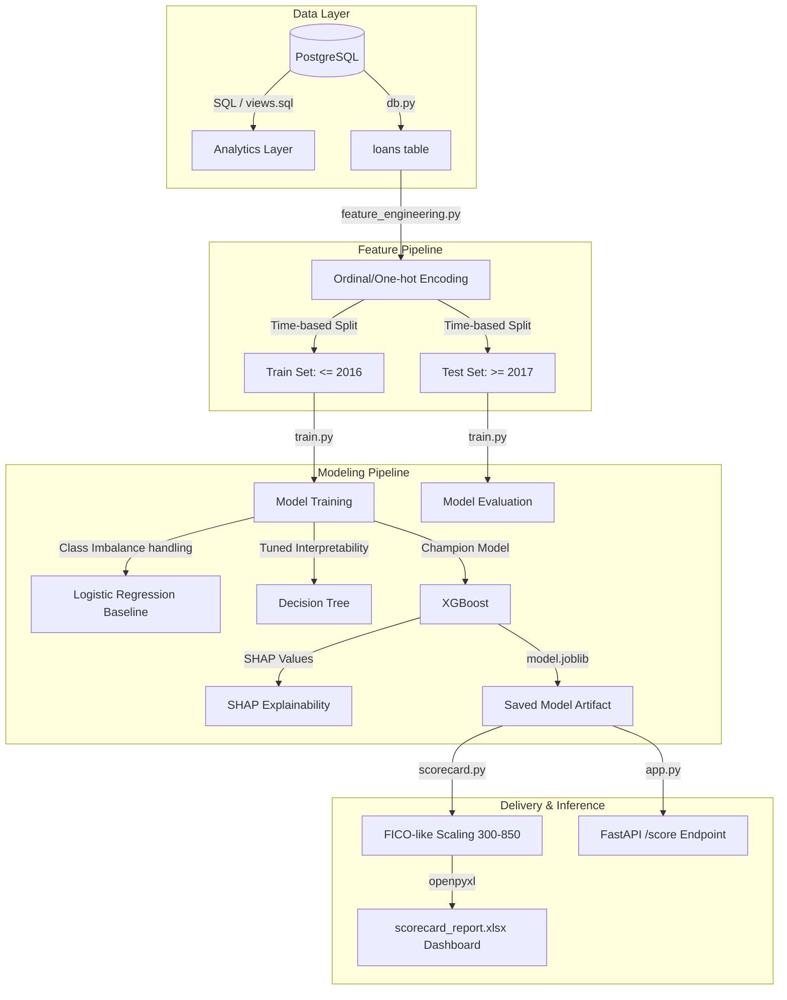

# Loan Default Credit Scoring & Scorecard Project

This project builds an end-to-end Machine Learning Credit Scoring pipeline using Lending Club loan default data. It connects to a local PostgreSQL instance, cleans the dataset, runs feature engineering, trains classification models (Logistic Regression baseline, Decision Tree, and XGBoost), generates a client-ready formatted Excel Scorecard, and exposes a FastAPI endpoint for real-time inference.

---

## 📐 Project Architecture & Workflow



---

## 🚀 How to Setup and Run

### 1. Configure the Environment
Ensure your local PostgreSQL service is running. Duplicate the `.env.template` file to `.env` and configure your credentials:
```env
DB_HOST=127.0.0.1
DB_PORT=5432
DB_USER=postgres
DB_PASSWORD=your_password
DB_NAME=loan_default
```

### 2. Prepare the Database
If you haven't already, load the PostgreSQL database schema and analytical views:
```powershell
# Load base schema
$env:PGPASSWORD='postgres'; & "C:\Program Files\PostgreSQL\18\bin\psql.exe" -U postgres -d loan_default -f sql\schema.sql

# Ingest data (loads cleaned loan CSV via COPY command)
.\venv\Scripts\python.exe src/ingest.py

# Load analytical views
$env:PGPASSWORD='postgres'; & "C:\Program Files\PostgreSQL\18\bin\psql.exe" -U postgres -d loan_default -f sql\views.sql
```

### 3. Run the Feature Engineering Pipeline
This script pulls data from Postgres, applies ordinal/one-hot encodings, performs a time-based train/test split, and outputs preprocessed datasets to `data/processed/`:
```powershell
.\venv\Scripts\python.exe src/feature_engineering.py
```

### 4. Train and Evaluate Models
This script trains Logistic Regression, a Decision Tree, and XGBoost. It handles the 80/20 default imbalance, evaluates using AUC-ROC/KS stats, generates SHAP explainability plots, and saves the trained champion model:
```powershell
.\venv\Scripts\python.exe src/train.py
```
Outputs will be saved in `output/`:
* `roc_curve.png`: Evaluation curves comparing model performance.
* `shap_summary.png`: Feature impact plots explaining predictions.
* `decision_tree.txt`: Human-readable rules of the decision tree model.
* `model.joblib`: The serialized XGBoost classifier.

### 5. Generate the Excel Scorecard Deliverable
This script queries the database for test metadata, scores all loans using our model, scales the probability of default into FICO-like credit scores (300-850), assigns loans to risk tiers (Low/Medium/High), and generates a fully styled dashboard report:
```powershell
.\venv\Scripts\python.exe src/scorecard.py
```
Output:
* `output/scorecard_report.xlsx`: Contains an executive dashboard showing default rates by risk tier, a cross-validation grid (Lending Club Grade vs Model Risk Tier), and granular account-level scores.

### 6. Run the FastAPI Service (Optional)
If you want to run the real-time scoring API, install `fastapi` and `uvicorn`, then start the web server:
```powershell
.\venv\Scripts\pip install fastapi uvicorn
.\venv\Scripts\python.exe -m uvicorn src.app:app --reload
```
You can query the API via a POST request to `http://127.0.0.1:8000/score` with borrower details to get a credit score and risk tier.---

## 📊 Model Performance & Analytical Findings

### 🏁 Model Evaluation Results (Test Set Validation)

| Model Name | AUC-ROC | KS-Statistic | Precision (Default) | Recall (Default) | F1-Score | Training Time |
| :--- | :---: | :---: | :---: | :---: | :---: | :---: |
| **XGBoost (Champion)** | **0.7117** | **0.3073** | **0.3262** | **68.16%** | **0.4412** | **16.8s** |
| **Logistic Regression** | 0.7028 | 0.2957 | 0.3321 | 62.53% | 0.4338 | 5.1s |
| **Decision Tree** | 0.6855 | 0.2749 | 0.3187 | 60.70% | 0.4180 | 7.5s |

### 💳 Calibrated Credit Score Risk Tiers (Validation Set)
* **Average Credit Score**: **605 points** (Score Range: 525 to 699)
* **Risk Tier Distribution**:
  * **Low Risk** (Credit Score $\ge$ 660, De-biased PD $\le$ 3.0%): **5,530 loans**
  * **Medium Risk** (Credit Score 580 - 659, De-biased PD 3.0% - 25.0%): **168,988 loans**
  * **High Risk** (Credit Score $<$ 580, De-biased PD $>$ 25.0%): **31,583 loans**

### 📈 Cross-Tabulation Matrix: Lending Club Grade vs. Model Risk Tier (Actual Default Rates)

| Lending Club Grade | Low Risk Tier | Medium Risk Tier | High Risk Tier | All Portfolio |
| :---: | :---: | :---: | :---: | :---: |
| **Grade A** | **1.70%** | 6.47% | 23.33% | **6.09%** |
| **Grade B** | **2.62%** | 12.06% | 30.63% | **13.44%** |
| **Grade C** | **2.88%** | 19.98% | 36.19% | **22.51%** |
| **Grade D** | 3.51% | 27.20% | 40.59% | **30.44%** |
| **Grade E** | 3.85% | 34.62% | 45.98% | **38.62%** |
| **Grade F** | 4.31% | 41.51% | 49.33% | **45.31%** |
| **Grade G** | 5.56% | 43.15% | 55.43% | **50.07%** |
| **Total Portfolio** | **1.96%** | **15.70%** | **37.76%** | **20.07%** |

### 💡 Key Insights
1. **Low-Risk Segmentation**: Loans placed in the model's **Low Risk Tier** carry an overall default rate of only **1.96%** (compared to the baseline average of 20.07%).
2. **Hidden Risk Detection**: High Risk Tier loans assigned to Lending Club's Grade A carry a **23.33% default rate**—which is worse than the portfolio average. The machine learning model successfully isolates hidden high-risk pockets within Lending Club's "safe" ratings.

---

## 📈 Credit Score Calibration Details

The model probability of default (PD) is converted into a FICO-style credit score using the standard credit log-odds scaling formula:

$$\text{Score} = \text{Offset} + \text{Factor} \times \ln(\text{Odds})$$
$$\text{Odds} = \frac{1 - PD}{PD}$$

Calibration constants:
* **Points to Double Odds (PDO)**: 20
* **Base Odds**: 4:1 (which maps to a score of 600, corresponding to the portfolio default rate of ~20%)
* **Score Limits**: Bounded strictly between 300 (High Risk) and 850 (Low Risk).
* **Risk Tiering**:
  * **Low Risk**: Credit Score $\ge$ 660 (De-biased PD $\le$ 3.0%)
  * **Medium Risk**: Credit Score 580 - 659 (De-biased PD 3.0% - 25.0%)
  * **High Risk**: Credit Score $<$ 580 (De-biased PD $>$ 25.0%)
